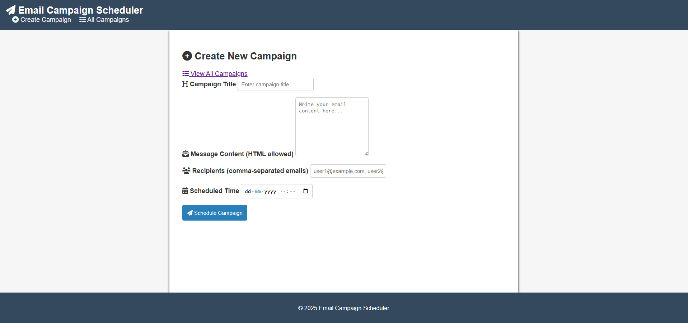

# 📧 Email Campaign Scheduler

A simple backend system built using **Node.js**, **Express**, **MongoDB**, and **Express-Handlebars** that allows users to schedule and manage email campaigns with ease.

## 📌 Features

- **Create Campaign API**  
  Submit campaigns with:
  - Title
  - Message (plain text or HTML)
  - Recipients (multiple email addresses)
  - Scheduled time to send emails

- **Email Scheduling**  
  Automatically sends emails to the provided recipients using `node-cron` based on the scheduled time.

- **Email Sending**  
  Uses `nodemailer` to deliver emails via SMTP.

- **Campaign Listing API**  
  View all campaigns (scheduled, sent, or failed) with their current status.

- **Email Status Logging**  
  Tracks individual email delivery status (success or failure) per recipient.

- **Frontend with Express-Handlebars**
  - Form to create and schedule a new campaign
  - Table/list view to display all campaigns with their status

---

## 🛠️ Tech Stack

- **Backend:** Node.js, Express.js
- **Database:** MongoDB + Mongoose
- **Templating Engine:** Express-Handlebars
- **Scheduler:** node-cron
- **Email:** nodemailer (SMTP)
- **Others:** dotenv, body-parser, multer (optional)

---

